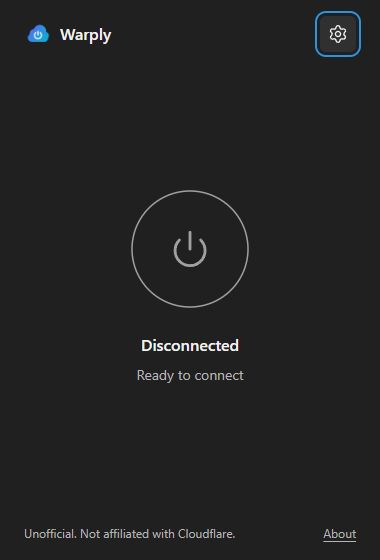
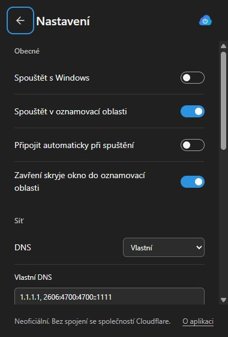
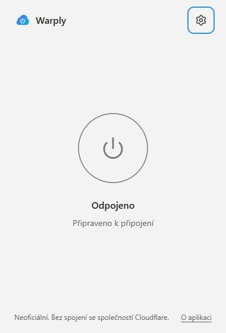

# UI and background review

## Implemented

- Exact supplied logo in the header and generated application icons. Fixed 380 × 560 window, native titlebar, Segoe fonts, neutral surfaces, a thin 120 px power ring, and one blue accent.
- System/light/dark themes with Windows 11 Mica where available. Solid fallback on Windows 10, disabled transparency, or high contrast. Reduced motion and keyboard focus styles.
- Separate Settings and About views, English/Czech strings, keyboard back navigation and retained scroll positions.
- General settings persist in Rust: start with Windows, start minimized, automatic connection, and close to tray (on by default).
- DNS presets/custom IP addresses and an advanced endpoint editor. Apply while disconnected; all validation and profile rewriting happen in Rust. Configuration mode preserves the current profile values. Leaving the endpoint empty preserves its current value. Overrides also apply to a newly generated account at the next connection.
- Rust tray: left click toggles, right click offers Connect/Disconnect, Open, Start with Windows and Quit. Monochrome icons derive from the original logo, follow the taskbar theme, and show dim disconnected/filled-dot connected states. Quit waits for disconnection; failure keeps the app available.
- Native single-instance mutex and existing-window focus. Elevation is requested on the first ordinary launch, not on toggles or when an existing window is found.
- A per-user Task Scheduler logon task with interactive identity, highest privileges, no execution timeout and battery operation. It starts hidden using `--autostart`. Enabling requires a Program Files installation; disabling removes the task. No Run registry key is used.
- Native network-interface and resume callbacks; physical adapter state/IP comparison ignores WireGuard's own virtual adapter changes. Reconnect uses five attempts with 5/10/20/40 second backoff. A new network change resets the retry budget. Normal user disconnect cancels reconnect intent.
- Silent native connection toasts only for an unexpected drop and exhausted reconnect attempts; one stable notification tag/group avoids stacking. Installed shortcuts have `app.warply.desktop` identity. Portable toast delivery is not guaranteed.
- Frontend status refresh every three seconds while visible and fifteen seconds when hidden; background supervision every five/fifteen seconds. No public-IP lookup or invented connection statistics.

## Verified automatically

Frontend production build, ESLint, Prettier, Rust formatting, unit tests and Clippy with warnings denied. Windows MSI and NSIS bundles build successfully. Browser fixture checks at 380 × 560 covered light/dark, Czech labels, settings toggles, custom DNS apply, Connecting/Connected/Disconnected rendering, keyboard power activation, Escape focus return, and registration-error recovery. Screenshots are visual fixture previews, not a live VPN session.

Read-only Windows test registers/unregisters real network and power callbacks and queries physical interfaces. It does not change networking, create tasks, install software or trigger sleep.

## Manual acceptance checklist

Use a disposable Windows VM with WireGuard to test native behavior:

- [ ] Light, dark, system theme, Czech/English; Tab/Space/Enter and Escape/Alt+Left; no clipping at display scales of 100%, 125%, 150%.
- [ ] Windows 11 Mica; transparency off; high contrast; Windows 10 solid fallback.
- [ ] Clean first launch without WireGuard: automatic account creation, one installation confirmation, successful installation or download/Check again recovery.
- [ ] Clean first launch with WireGuard: no setup dialogs. Second launch reuses the account; no registration or repeated installer prompts.
- [ ] Connect/disconnect through the button and tray left click. Right-click menu and tooltip reflect status; dark/light taskbar changes update the icon.
- [ ] X hides the connected app without stopping the service. Open restores it. Disable close-to-tray and verify X disconnects and exits. Quit disconnects and exits; a failed disconnect keeps an error visible.
- [ ] Launch a second copy while visible and while hidden: one process remains and its window is focused, without another UAC prompt.
- [ ] Install in Program Files; enable Start with Windows and inspect `Warply-<user SID>` in Task Scheduler. Reboot/log on: hidden startup without UAC; automatic connection when enabled. Disable and confirm the task is removed. A development/portable location must be refused.
- [ ] Enable start minimized, then launch manually: only tray appears. Setup failures must reopen the window.
- [ ] Sleep/resume and switch Wi-Fi/Ethernet while connected: supervisor rebuilds the tunnel. User disconnect during an in-flight recovery must cancel recovery intent, wait for that operation and then disconnect. Stop/remove the WireGuard service unexpectedly: one interruption toast and recovery. Force five reconnect failures: one failure toast and visible/tray error, with no endless retry loop.
- [ ] DNS presets, valid custom IPv4/IPv6 and advanced endpoint: apply disconnected, reconnect, inspect DNS/network behavior. Invalid addresses, newline injection and port zero must fail. Profile keys/routes remain unchanged. Connected network controls are disabled.
- [ ] Offline registration/rate limit/API rejection, import fallback, reset and explicit warned export. Private keys never appear in the UI or logs.
- [ ] Windows notifications enabled/disabled: no toast on ordinary connect/disconnect; installed identity delivers the two exceptional notifications.

## Limits still needing review

Native Mica on other OS versions, installed tray behavior, elevated task creation/reboot, single-instance focus across integrity levels, actual tunnel recovery after sleep, and toast delivery have not been exercised end to end here. Tunnel status is the WireGuard Windows service state; it does not prove a recent WireGuard handshake or successful Internet traffic. The supervisor handles service drops and OS network/resume events, not every possible silent UDP blackhole.

An ordinary fresh launch after Quit still requests one UAC elevation. Task Scheduler logon starts and focusing an existing instance do not. Removing elevation from every fresh manual launch requires the privileged-helper/service work in the separate security-hardening request.

The prior security-hardening request remains pending. See [current audit](security-model.md), especially plaintext profile storage and the elevated webview. This build is a review artifact, not a signed hardened release.

## Visual previews

